# 💰 Controle Financeiro Pessoal – Delphi Desktop

Sistema desktop de **controle financeiro pessoal multiusuário**, desenvolvido em **Delphi**, voltado para organização de receitas, despesas, investimentos, orçamento e análise financeira por meio de relatórios e gráficos.

Este projeto foi construído como uma solução prática para uso real no dia a dia, permitindo controle detalhado das finanças pessoais, categorização de gastos, importação de extratos bancários e acompanhamento de orçamento previsto versus realizado.

---

## 📌 Visão Geral

- Aplicação **multiusuário** (cada usuário possui dados financeiros independentes)
- Cadastro e classificação detalhada de movimentações financeiras
- Importação de extratos bancários em arquivo `.txt`
- Controle de orçamento e compromissos financeiros
- Relatórios e gráficos analíticos e sintéticos
- Persistência de dados em banco **Firebird**
- Relatórios gerados com **Fortes Report**

---

## 🖥️ Tecnologias Utilizadas

- **Delphi (VCL Desktop)**
- **Banco de Dados Firebird**
- **Fortes Report** (único componente de terceiros)
- Componentes **nativos do Delphi**
- Arquitetura desktop tradicional amplamente utilizada em sistemas corporativos
---

### 🧬 Arquitetura de Formulários e Herança Visual

Para garantir padronização visual, reutilização de código e facilidade de manutenção, o sistema foi desenvolvido utilizando **formulários base** (modelos) para os principais tipos de telas:

- Cadastros
- Consultas
- Diálogos
- Relatórios

A partir desses formulários padronizados, as demais telas do sistema foram construídas por **herança**, permitindo:

- consistência de layout e comportamento
- centralização de regras comuns
- redução de código duplicado
- manutenção mais simples e segura

## 🗄️ Banco de Dados e Regras de Negócio

- Banco de dados: **Firebird**
- Sistema preparado para **ambiente multiusuário**
- As regras de negócio estão distribuídas entre:
  - aplicação Delphi
  - banco de dados

### 🔧 Regras de Negócio no Banco

Parte importante das regras de negócio foi implementada diretamente no banco de dados, utilizando:

- **Stored Procedures**
- **Views**
- Consultas consolidadas para relatórios

Essas estruturas são utilizadas principalmente para:
- consolidação de dados financeiros
- cálculo de valores previstos e realizados
- geração de relatórios sintéticos e analíticos
- otimização de consultas complexas

Essa abordagem foi adotada para:
- centralizar regras críticas
- melhorar performance
- garantir consistência dos dados
- refletir práticas comuns em sistemas corporativos desktop

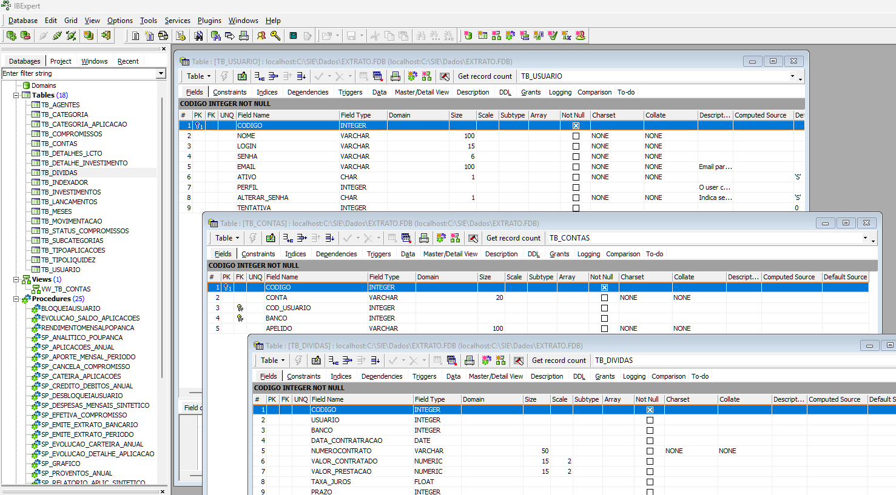
<br>

---

## 📂 Organização do Projeto

```text
controle-financeiro-delphi
│
├── Bibliotecas        # Classes e entidades do sistema
├── Cadastros          # Telas de cadastro
├── Consultas          # Telas de consulta e regras associadas
├── Dialogos           # Diálogos (login, filtros, impressão, etc.)
├── Importacao         # Importação de extratos bancários (.txt)
├── Modelo             # Formulários base (herança visual)
├── Relatorios         # Relatórios com Fortes Report
├── Icones             # Recursos visuais
│
├── dmConexao.pas/.dfm     # DataModule de conexão
├── frmPrincipal.pas/.dfm # Tela principal
├── Config.ini            # Configuração (sem dados sensíveis)
├── SIE4.dpr               # Projeto Delphi
```

> Algumas bibliotecas, scripts de banco e rotinas específicas foram removidos por questões de segurança e privacidade.

> Todas as imagens utilizam dados, valores, nomes de usuários fictícios para fins de demonstração.

---

## 🧭 Funcionalidades Principais

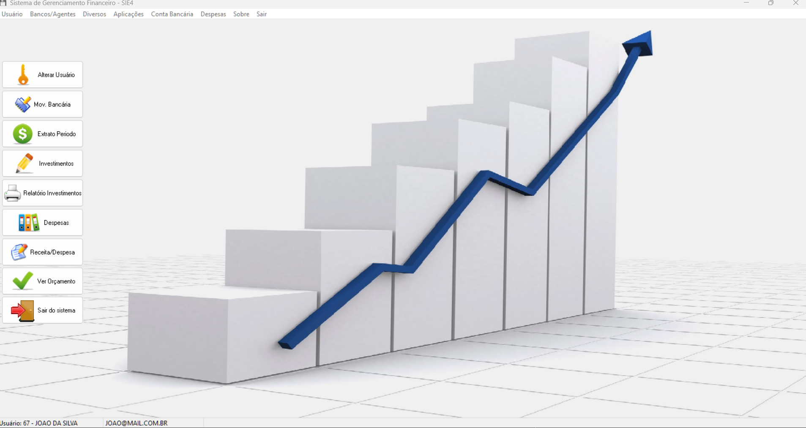
<br>

### 🔐 Usuários
- Cadastro de usuários
- Login
- Redefinição de senha
- Isolamento completo de dados por usuário

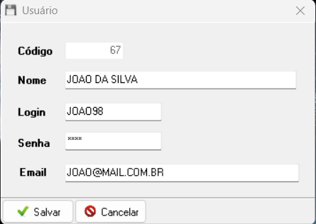
<br>

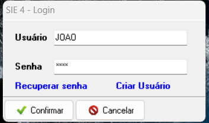
<br>
---

### 💼 Movimentação Financeira
- Cadastro de contas bancárias
- Lançamentos manuais de crédito e débito
- Histórico de movimentações bancárias
- Importação de extratos bancários em `.txt`
- Classificação por:
  - Categoria
  - Subcategoria
  - Descrição

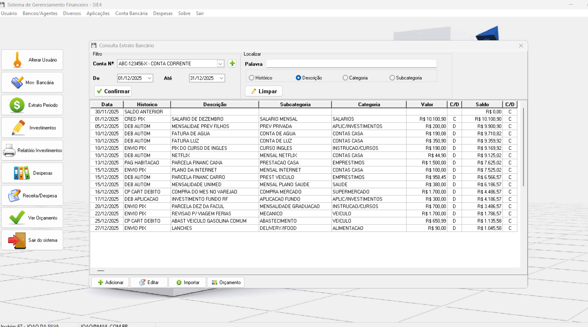
<br>
---

### 🗂️ Categorias
- Categorias e subcategorias de:
  - Receitas
  - Despesas
  - Investimentos
  - Reinvestimentos
- Utilizadas como base para relatórios e gráficos

---

### 📊 Orçamento Financeiro
- Cadastro de compromissos financeiros futuros
- Controle de **Previsto × Realizado**
- Repetição de lançamentos (mensal, por período)
- Efetivação automática no extrato bancário
- Consolidação por categoria e subcategoria

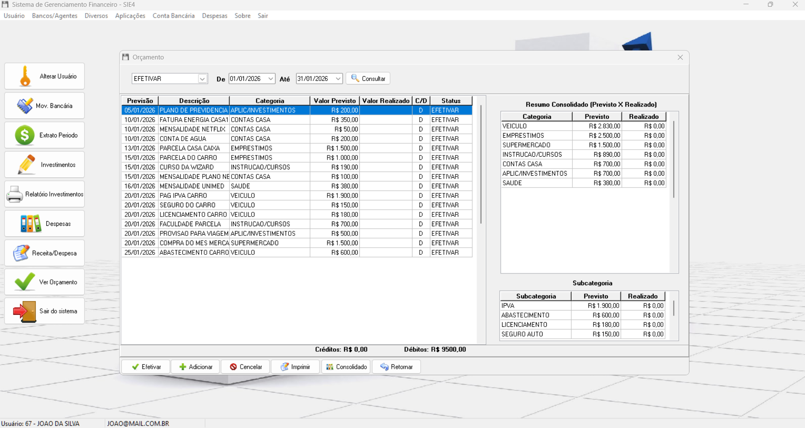
<br>
---

### 📈 Consultas e Dashboards
- Consulta de extrato por período
- Lançamentos futuros destacados
- Dashboards analíticos:
  - despesas mensais
  - despesas por categoria
  - receitas × despesas × poupança
- Histórico e relatórios de investimentos

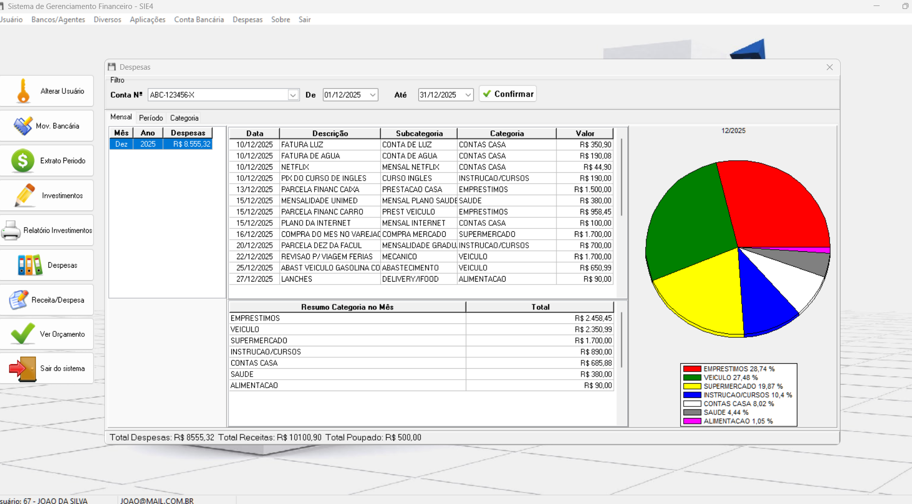
<br>

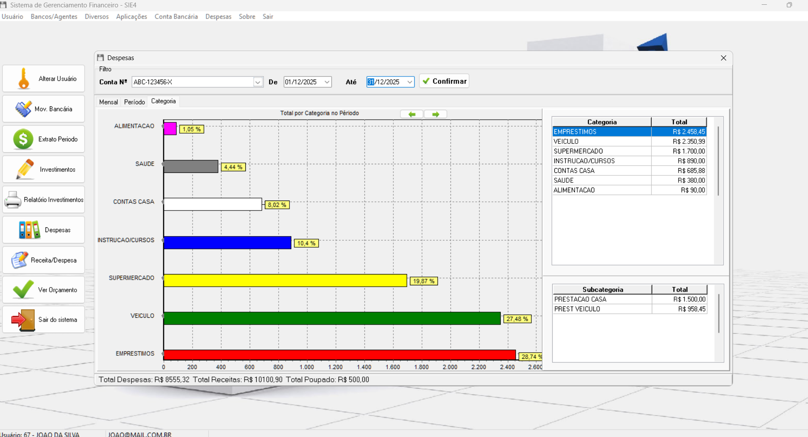
<br>
---

### 🧾 Relatórios (Fortes Report)

- Extrato bancário (com ou sem classificações)
- Relatório sintético de despesas por período
- Relatório consolidado de orçamento
- Relatórios de investimentos
- Exportação em **PDF**

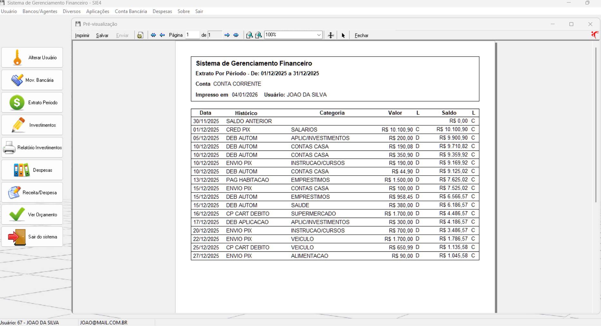
<br>

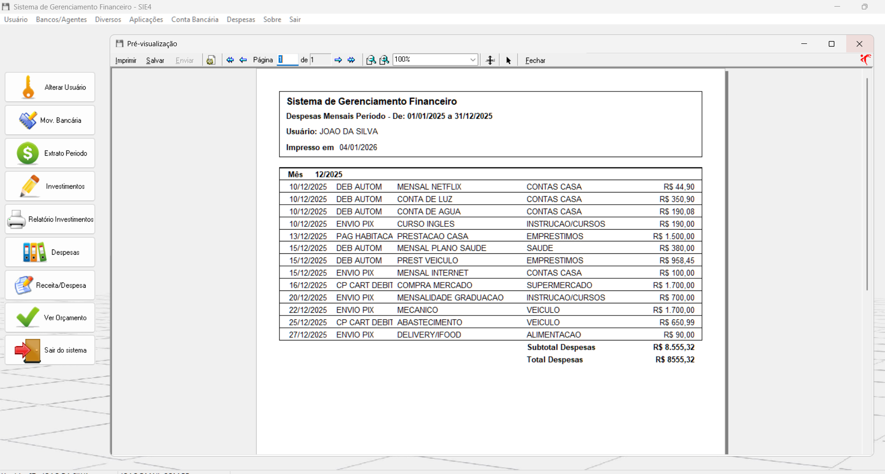
<br>


<br>

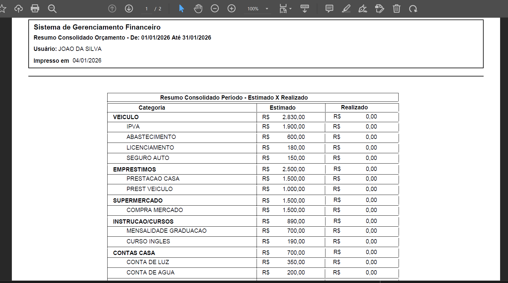
<br>
---
Esses prints foram incluídos para ilustrar o funcionamento do sistema sem expor dados reais.

---

## ⚠️ Observações Importantes

Este repositório tem finalidade **educacional e de portfólio**.  
Por isso, **não foram disponibilizados publicamente**:

- scripts completos de banco de dados
- procedures e views sensíveis
- módulos específicos de negócio (ex.: investimentos avançados)
- bibliotecas de criptografia

Esses elementos são demonstrados por meio da:
- organização do projeto
- estrutura do código
- telas
- relatórios
- descrição funcional
---

## 🚀 Objetivo do Projeto

- Demonstrar domínio em **Delphi Desktop**
- Evidenciar arquitetura típica de sistemas corporativos
- Apresentar boas práticas em:
  - organização de código
  - separação de responsabilidades
  - uso de banco de dados
  - relatórios e análises financeiras
- Servir como **portfólio técnico**
---

## 👤 Autor

Pedro Lopes 
Projeto desenvolvido para uso pessoal e demonstração de conhecimento em desenvolvimento desktop com Delphi e banco de dados Firebird.
---

## 📄 Licença

Este projeto é disponibilizado exclusivamente para fins educacionais e de portfólio.  
Uso comercial não autorizado.

